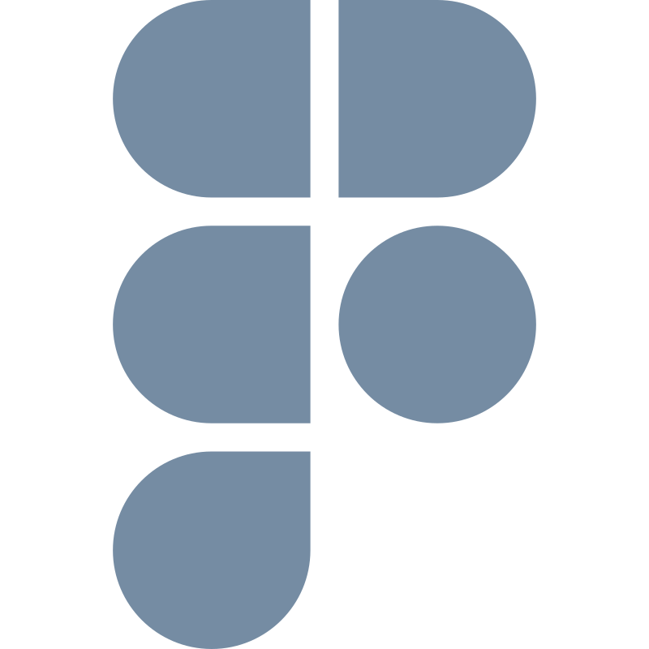

<h2>Olá, me chamo Fabio Rodrigues!!!</h2>

- 🔭 Estou em busca da minha oportunidade como desenvolvedor de Fullstack!
- 🌱 Possuo conhecimento em Node.js, Sequelize, Express, Docker, TypeScript, MySQL, ReactJS, React Native, Figma. E atualmente, estou aprendendo sobre Java.
- 👯 Estou procurando colaborar em projetos que me permitam aprender e crescer como desenvolvedor.
- 🤔 Estou buscando ajuda com oportunidades de desenvolvimento profissional e networking na área de tecnologia.
- 💬 Pergunte-me sobre desenvolvimento Fullstack, Node.js, ReactJS, React Native, Docker, TypeScript, MySQL ou qualquer outra coisa relacionada à tecnologia!
- 📫 Me mande um e-mail: fabur13@gmail.com
- 😄 Pronome: ele/dele
- ⚡ Fato divertido: Formei em engenharia civil em 2015, e recentemente fiz uma transição de carreira para a área de desenvolvimento de software.

  

<h3>Tecnologias e Ferramentas</h3>

  
  
  
  
  
  
  
  
  
    

 
<h3>Meus Contatos</h3>
&nbsp;

&nbsp;&nbsp;

