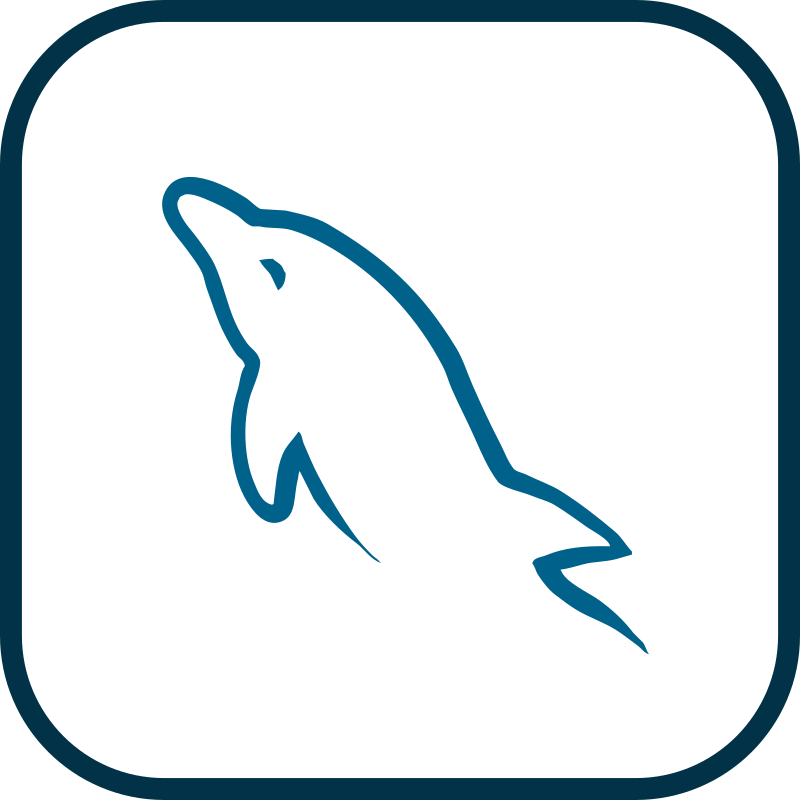
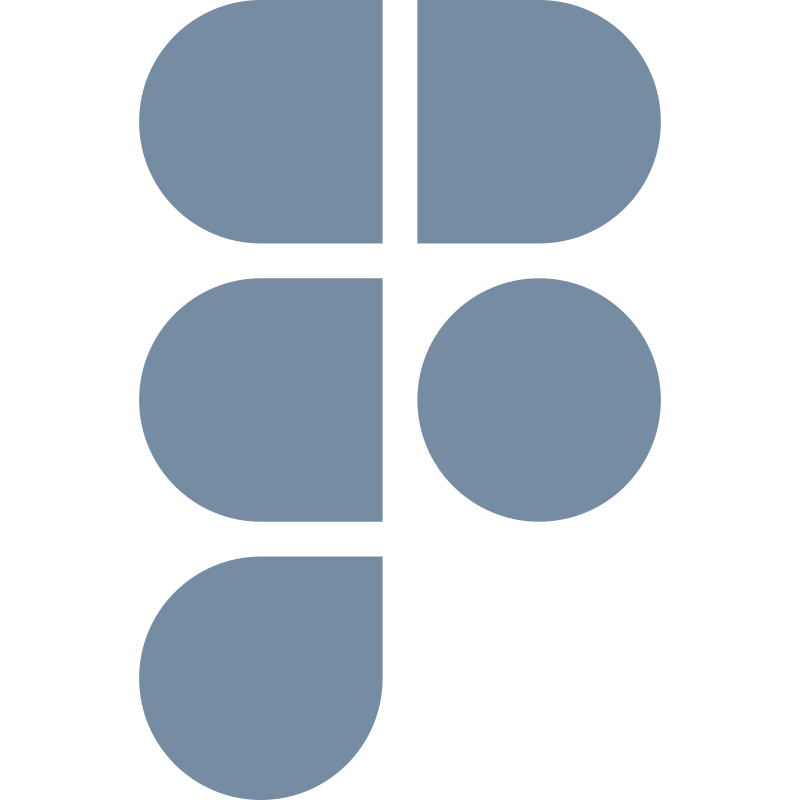

# Olá, eu sou Fábio Rodrigues👋 #

## 💻 Desenvolvedor Front-end ##

Desenvolvedor com foco na construção de aplicações web utilizando JavaScript, TypeScript e React.

## 🛠️ Tecnologias ##

### Front-end ###
- JavaScript
- TypeScript
- React
- Next.js
- HTML
- CSS

### Back-end ###

- Node.js
- Express
- Ruby on Rails
- Java

### Banco de dados ###

- MySQL
- PostgreSQL

### Testes e ferramentas ###

- Jest
- React Testing Library
- Docker
- Git
- GitHub

  

<h3>Tecnologias e Ferramentas</h3>

  
  
  
  
  
  
  
  
  
    

### Meus Contatos

